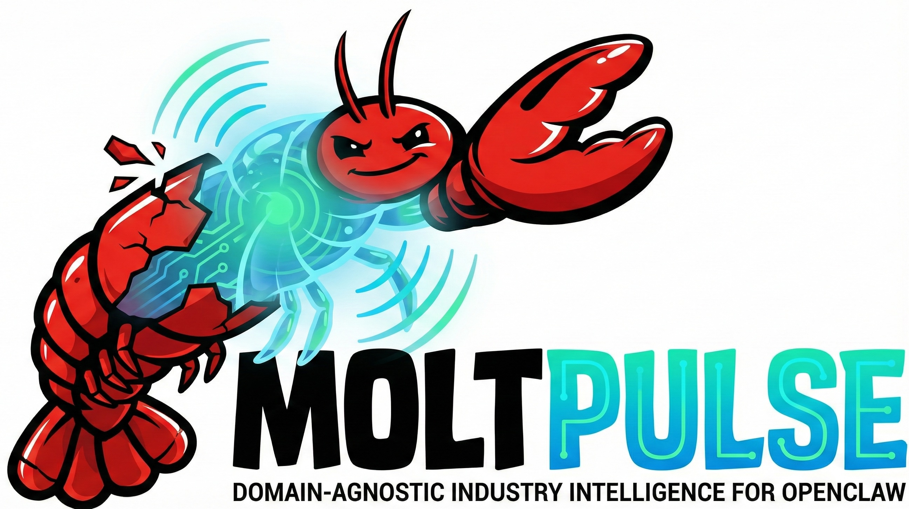

# MoltPulse

<p align="center">
  
</p>

<p align="center">
  <a href="https://github.com/gregce/moltpulse/actions/workflows/ci.yml"></a>
  <a href="LICENSE"></a>
  <a href="https://www.python.org/downloads/"></a>
  <a href="https://github.com/astral-sh/ruff"></a>
  <a href="https://github.com/openclaw/openclaw"></a>
</p>

> Domain-agnostic industry intelligence framework

MoltPulse monitors industries, tracks market trends, and generates intelligence reports. Configure **domains** (advertising, healthcare, fintech), define **user profiles**, and schedule automated reports.

```
┌────────────────────────────────────────────────────────────────────────┐
│                              MOLTPULSE                                 │
├────────────────────────────────────────────────────────────────────────┤
│                                                                        │
│  ┌──────────┐    ┌──────────┐    ┌─────────────┐    ┌──────────┐       │
│  │  DOMAIN  │───▶│ PROFILE  │───▶│ ORCHESTRATOR│───▶│ DELIVERY │       │
│  │  (what)  │    │  (who)   │    │    (how)    │    │ (where)  │       │
│  └──────────┘    └──────────┘    └─────────────┘    └──────────┘       │
│                                                                        │
└────────────────────────────────────────────────────────────────────────┘
```

## Quick Start

### Install

```bash
# From source
uv tool install /path/to/moltpulse

# Or with pip
pip install moltpulse
```

### Configure

```bash
# Interactive setup
moltpulse config set

# Or set keys directly
moltpulse config set ALPHA_VANTAGE_API_KEY your_key
moltpulse config set NEWSDATA_API_KEY your_key

# Check status
moltpulse config
```

### Run

```bash
# Generate a daily brief
moltpulse run --domain=advertising --profile=ricki daily

# Preview without running collectors
moltpulse run --domain=advertising --profile=ricki --dry-run daily

# Deep collection for comprehensive reports
moltpulse run --domain=advertising --profile=ricki --deep weekly
```

## Documentation

| Guide | Description |
|-------|-------------|
| [Getting Started](docs/getting-started.md) | Installation and first run |
| [Architecture](docs/architecture.md) | System design, data flow, and scoring |
| [Domains](docs/domains.md) | Creating and configuring domains |
| [Profiles](docs/profiles.md) | User profile customization and delivery |
| [Monitoring](docs/monitoring.md) | Run execution tracing and debugging |

## Commands

| Command | Description |
|---------|-------------|
| `run` | Generate a report |
| `config` | Manage API keys and settings |
| `domain` | List, show, create domains |
| `profile` | List, show, create profiles |
| `cron` | Manage OpenClaw cron integration |

## Report Types

| Type | Command | Description |
|------|---------|-------------|
| Daily Brief | `moltpulse run ... daily` | Morning intelligence with stock performance, top news, thought leader highlights |
| Weekly Digest | `moltpulse run ... weekly` | Comprehensive weekly analysis with trends and M&A activity |
| Fundraising | `moltpulse run ... fundraising` | Nonprofit-focused outlook with timing recommendations |

## Collectors & Data Sources

MoltPulse uses a collector architecture where each data source is encapsulated in a collector class. The advertising domain ships with these collectors:

```
┌────────────────────────────────────────────────────────────────────────┐
│                    ADVERTISING DOMAIN COLLECTORS                       │
├────────────────────────────────────────────────────────────────────────┤
│                                                                        │
│  ┌───────────────────┐      ┌────────────────────────────────────┐     │
│  │ Financial         │─────▶│ Alpha Vantage API                  │     │
│  │ (stock prices)    │      │ Holding company stock performance  │     │
│  └───────────────────┘      └────────────────────────────────────┘     │
│                                                                        │
│  ┌───────────────────┐      ┌────────────────────────────────────┐     │
│  │ News              │─────▶│ NewsData.io API (primary)          │     │
│  │ (industry news)   │      │ NewsAPI (fallback)                 │     │
│  └───────────────────┘      └────────────────────────────────────┘     │
│                                                                        │
│  ┌───────────────────┐      ┌────────────────────────────────────┐     │
│  │ RSS               │─────▶│ Ad Age, AdWeek, Campaign, The Drum │     │
│  │ (publications)    │      │ Marketing Week, Digiday, Forbes    │     │
│  └───────────────────┘      └────────────────────────────────────┘     │
│                                                                        │
│  ┌───────────────────┐      ┌────────────────────────────────────┐     │
│  │ Social            │─────▶│ xAI API with x_search tool         │     │
│  │ (thought leaders) │      │ Tracks handles defined in profiles │     │
│  └───────────────────┘      └────────────────────────────────────┘     │
│                                                                        │
│  ┌───────────────────┐      ┌────────────────────────────────────┐     │
│  │ Awards            │─────▶│ Web scraping (no API key)          │     │
│  │ (industry awards) │      │ Cannes Lions, Effies, Clios, etc.  │     │
│  └───────────────────┘      └────────────────────────────────────┘     │
│                                                                        │
│  ┌───────────────────┐      ┌────────────────────────────────────┐     │
│  │ PE Activity       │─────▶│ Intellizence API (primary)         │     │
│  │ (M&A tracking)    │      │ News APIs (fallback for M&A news)  │     │
│  └───────────────────┘      └────────────────────────────────────┘     │
│                                                                        │
└────────────────────────────────────────────────────────────────────────┘
```

### API Keys

| Key | Provider | Collector | Required? |
|-----|----------|-----------|-----------|
| `ALPHA_VANTAGE_API_KEY` | [Alpha Vantage](https://www.alphavantage.co/) | Financial | Yes for stock data |
| `NEWSDATA_API_KEY` | [NewsData.io](https://newsdata.io/) | News, PE Activity | Either this or NewsAPI |
| `NEWSAPI_API_KEY` | [NewsAPI](https://newsapi.org/) | News, PE Activity | Either this or NewsData |
| `XAI_API_KEY` | [xAI](https://x.ai/) | Social | Yes for X/Twitter |
| `INTELLIZENCE_API_KEY` | Intellizence | PE Activity | Optional (uses news fallback) |

**Note:** RSS and Awards collectors require no API keys - they use direct HTTP requests and web scraping.

### Key Configuration

```bash
# Store in ~/.config/moltpulse/.env (secure, permissions 0600)
moltpulse config set ALPHA_VANTAGE_API_KEY your_key
moltpulse config set NEWSDATA_API_KEY your_key

# Or set via environment variables
export ALPHA_VANTAGE_API_KEY=your_key
export NEWSDATA_API_KEY=your_key

# Check which collectors are available
moltpulse config
```

### Collector Availability

Run `moltpulse config` to see which collectors are enabled based on your configured API keys:

```
API Keys:
  ✓ ALPHA_VANTAGE_API_KEY  sk-...abc  (Financial data)
  ✓ NEWSDATA_API_KEY       nd-...xyz  (News aggregation)
  ✗ XAI_API_KEY            not set    (X/Twitter search)

Collectors:
  ✓ Financial    Alpha Vantage stock data
  ✓ News         News aggregation
  ✓ RSS          RSS feeds (no key required)
  ✗ Social/X     Needs XAI_API_KEY
  ✓ Awards       Industry awards (no key required)
  ✓ PE/M&A       M&A tracking via news fallback
```

## CLI Flags

### Run Command

| Flag | Description |
|------|-------------|
| `--domain` | **Required.** Domain instance (e.g., `advertising`, `healthcare`) |
| `--profile` | Interest profile to load (default: `default`) |
| `--quick` | Shallow data collection - fewer items, faster execution |
| `--deep` | Thorough data collection - more items, longer timeouts |
| `--dry-run` | Preview what would be collected without running |
| `--deliver` | Send report via profile's delivery channel (email, file) |
| `--no-deliver` | Output to stdout only, skip delivery (for OpenClaw) |
| `--output` | Format: `compact` (default), `markdown`, `json`, `full` |
| `--output-path` | Write output to file instead of stdout |
| `--from-date` | Start date (YYYY-MM-DD), defaults based on report type |
| `--to-date` | End date (YYYY-MM-DD), defaults to today |
| `--trace` | Show detailed execution trace with API calls and timing |
| `--verbose`, `-v` | Verbose output with debug information |

### Collector Control Flags

| Flag | Description |
|------|-------------|
| `--collectors` | Comma-separated list of collectors to run (e.g., `news,rss,financial`) |
| `--exclude-collectors` | Comma-separated list of collectors to skip (e.g., `pe_activity,awards`) |
| `--no-cache` | Bypass cache and fetch fresh data |
| `--quiet`, `-q` | Suppress progress output (for cron/CI environments) |
| `--limit` | Maximum items per collector (overrides depth defaults) |
| `--retry` | Number of retries for failed API calls (default: 0) |
| `--timeout` | Custom timeout per collector in seconds |

### Report-Specific Flags

| Report | Flag | Description |
|--------|------|-------------|
| `daily` | `--sections` | Specific sections to include |
| `weekly` | `--sections` | Specific sections to include |
| `fundraising` | `--horizon` | Forecast horizon: `6m`, `1y`, `3y`, `all` |

### Examples

```bash
# Only run news and RSS collectors
moltpulse run --domain=advertising --profile=ricki --collectors=news,rss daily

# Skip slow PE activity collector
moltpulse run --domain=advertising --profile=ricki --exclude-collectors=pe_activity daily

# Force fresh data, quiet mode for cron
moltpulse run --domain=advertising --profile=ricki --no-cache --quiet daily

# Limit to 5 items per collector
moltpulse run --domain=advertising --profile=ricki --limit=5 daily

# Retry failed API calls up to 3 times
moltpulse run --domain=advertising --profile=ricki --retry=3 daily
```

## OpenClaw Integration

MoltPulse integrates with [OpenClaw](https://github.com/openclaw/openclaw) for scheduled, automated report generation. OpenClaw (created by [@steipete](https://github.com/steipete)) has a cron scheduler that can run commands on a schedule and OpenClaw can also handle delivery.

### How It Works

When integrated with OpenClaw, the execution flow is:

```
┌────────────────────────────────────────────────────────────────────────┐
│                       OPENCLAW ORCHESTRATION                           │
├────────────────────────────────────────────────────────────────────────┤
│                                                                        │
│  ┌──────────┐    ┌───────────┐    ┌───────────┐    ┌───────────┐       │
│  │ SCHEDULE │───▶│ OPENCLAW  │───▶│ MOLTPULSE │───▶│ OPENCLAW  │       │
│  │  (cron)  │    │ (trigger) │    │ (collect) │    │ (deliver) │       │
│  └──────────┘    └───────────┘    └───────────┘    └───────────┘       │
│       │                                                  │             │
│       ▼                                                  ▼             │
│  "0 7 * * 1-5"                                    Email/Slack/         │
│  (7am weekdays)                                    Custom hook         │
│                                                                        │
└────────────────────────────────────────────────────────────────────────┘
```

1. **OpenClaw triggers** MoltPulse at scheduled times (e.g., 7am weekdays)
2. **MoltPulse collects** data from APIs, RSS feeds, and scrapers
3. **MoltPulse generates** the report in markdown format
4. **OpenClaw delivers** via its configured channels (email, Slack, webhooks)

The key insight: MoltPulse handles data collection and report generation, while OpenClaw handles scheduling and delivery orchestration.

### Cron Templates

MoltPulse ships with pre-configured cron templates:

| Template | Schedule | Description |
|----------|----------|-------------|
| `daily-brief` | `0 7 * * 1-5` (7am weekdays) | Morning intelligence brief |
| `weekly-digest` | `0 8 * * 1` (8am Monday) | Weekly analysis digest |
| `fundraising-outlook` | `0 9 1 * *` (9am 1st of month) | Monthly fundraising outlook |

### Installing Cron Jobs

```bash
# List available templates
moltpulse cron list

# Show template details
moltpulse cron show daily-brief

# Preview install commands (dry run)
moltpulse cron install --all --dry-run

# Install all templates to OpenClaw
moltpulse cron install --all

# Install a specific template
moltpulse cron install daily-brief
```

### Template Format

Cron templates are JSON files in `src/moltpulse/cron/`:

```json
{
  "name": "MoltPulse Daily Brief",
  "description": "Generate and deliver morning industry intelligence brief",
  "schedule": {
    "kind": "cron",
    "expr": "0 7 * * 1-5",
    "tz": "America/Los_Angeles"
  },
  "sessionTarget": "isolated",
  "payload": {
    "kind": "agentTurn",
    "message": "moltpulse run --domain=advertising --profile=ricki --output=markdown --no-deliver daily",
    "deliver": true
  }
}
```

Key fields:
- **`schedule.expr`**: Standard cron expression
- **`schedule.tz`**: Timezone for schedule
- **`sessionTarget`**: `isolated` (clean session) or `resume` (continue existing)
- **`payload.message`**: The moltpulse command to run
- **`payload.deliver`**: Whether OpenClaw should deliver the output

### The `--no-deliver` Flag

When running under OpenClaw, use `--no-deliver` to let OpenClaw handle delivery:

```bash
# MoltPulse outputs to stdout, OpenClaw delivers
moltpulse run --domain=advertising --profile=ricki --output=markdown --no-deliver daily
```

Without this flag, MoltPulse would attempt its own delivery (email/file), potentially duplicating OpenClaw's delivery.

### Running Without OpenClaw

MoltPulse works standalone - OpenClaw is optional:

```bash
# Manual run with console output
moltpulse run --domain=advertising --profile=ricki daily

# Manual run with file output
moltpulse run --domain=advertising --profile=ricki --output=markdown --output-path=report.md daily

# Manual run with email delivery (uses profile's delivery config)
moltpulse run --domain=advertising --profile=ricki --deliver daily
```

## Development

### Setup

```bash
# Clone and setup
git clone https://github.com/gregce/moltpulse.git
cd moltpulse

# Install uv if you don't have it
curl -LsSf https://astral.sh/uv/install.sh | sh

# Install dependencies (including dev tools)
uv sync --all-extras

# Verify installation
uv run moltpulse --version
```

### Common Commands

```bash
# Run from source (always uses latest code)
uv run moltpulse run --domain=advertising --profile=ricki daily

# Run tests
uv run pytest tests/ -v

# Run specific test file
uv run pytest tests/test_scoring.py -v

# Run with coverage
uv run pytest tests/ --cov=moltpulse

# Lint and format
uv run ruff check src/
uv run ruff format src/

# Reinstall after pyproject.toml changes
uv sync

# Force full reinstall
uv sync --reinstall
```

### Project Structure

```
moltpulse/
├── src/moltpulse/       # Main package
│   ├── cli.py           # CLI entry point
│   ├── core/            # Core modules (orchestrator, scoring, delivery)
│   ├── collectors/      # Data source collectors
│   └── domains/         # Domain configurations
├── tests/               # Test suite
├── docs/                # Documentation
└── pyproject.toml       # Project config
```

See [CONTRIBUTING.md](CONTRIBUTING.md) for detailed development guidelines, including:
- Adding new collectors
- Creating new domains
- Implementing report types
- Code style and testing

See [Architecture](docs/architecture.md) for system design overview.

## License

MIT
